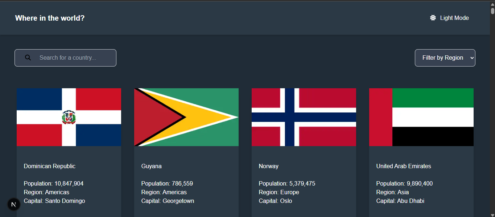
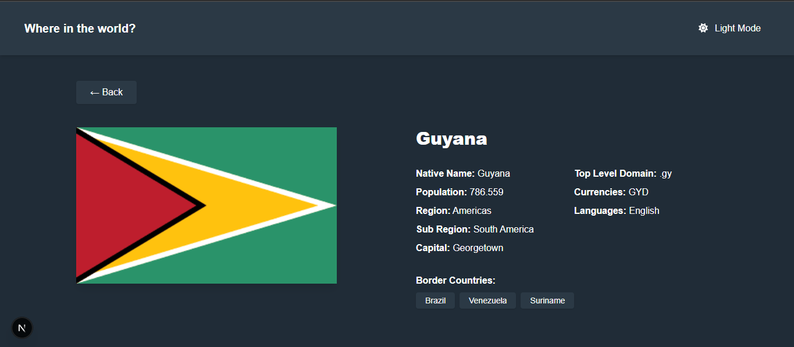

# 🌍 Countries Explorer

Aplicación web desarrollada con **Next.js** que permite explorar información detallada de países consumiendo la API pública [REST Countries](https://restcountries.com/).

---

## 📐 Arquitectura y Enfoque

La solución se diseñó bajo una arquitectura **modular y escalable**, separando las responsabilidades de forma clara:

### 🧱 Estructura del proyecto

```
/src
│
├── /app                     → Rutas y páginas (Next.js App Router)
│   └── /dashboard           → Página principal con búsqueda y filtro
│   └── /detail/[country]    → Vista de detalle por país
│
├── /ui                      → Componentes reutilizables
│   ├── /home                → Tarjetas, botones, etc.
│   ├── /header              → Input, Select y Header
│
├── /lib                     → Utilidades (icons, fuentes, helpers)
├── global.css                  → Estilos globales con Tailwind
└── /public                  → Assets e íconos
```

### 🔧 Stack utilizado

- **Next.js** (App Router)
- **TailwindCSS** para estilos
- **API REST Countries v3.1**
- **Dark Mode** (con `next-themes`)
- **React Hooks** (para gestión de estado y efectos)
- **FontAwesome** (iconos)
- **Google Fonts (Nunito)** con `next/font`

---

## 🧠 Solución técnica

El desarrollo se enfocó en cumplir todos los requisitos del reto, priorizando la **usabilidad**, el **rendimiento**, la **limpieza del código** y la **adaptabilidad a distintos dispositivos**.

- 🌐 **Integración con la API REST Countries** mediante `fetch()` nativo.
- 🔍 **Buscador funcional** por nombre de país (filtro local).
- 📁 **Filtro funcional por región**.
- 📱 **Diseño responsivo** adaptado a móviles, tabletas y escritorio.
- 🌒 **Soporte para Dark Mode**, sincronizado con el sistema.
- 🧭 **Routing dinámico** con la ruta `/detail/[country]` para mostrar el detalle del país.
- ✅ Validación de datos y manejo de errores.
- 🎨 Tipografía consistente con **Google Fonts (Nunito)** y clases semánticas.

---

## 📸 Vista previa




---

## 🚀 Instalación y ejecución

### 1. Clonar el repositorio

```bash
git clone https://github.com/tu-usuario/countries-explorer.git
cd countries-explorer
```

### 2. Instalar dependencias

```bash
npm install
# o
pnpm install
```

### 3. Ejecutar la app en modo desarrollo

```bash
npm run dev
# o
pnpm dev
```

Abre [http://localhost:3000](http://localhost:3000) en tu navegador.

---

## ✅ Funcionalidades

- [x] Visualización de países
- [x] Búsqueda por nombre
- [x] Filtro por región
- [x] Detalle de cada país
- [x] Modo oscuro
- [x] Adaptabilidad a dispositivos móviles
- [x] Pruebas unitarias (en desarrollo)

---

## 🔍 Recursos

- API: [https://restcountries.com](https://restcountries.com)
- Iconos: [FontAwesome](https://fontawesome.com/)
- Estilos: [TailwindCSS](https://tailwindcss.com/)
- Tipografía: [Google Fonts - Nunito](https://fonts.google.com/specimen/Nunito)

---

## 🤝 Autor

Luis Mejía  
[GitHub](https://github.com/MejiaLuigi) | [LinkedIn](www.linkedin.com/in/luis-hoyos-mejia-731a78243

)

---

## 📄 Licencia

Este proyecto fue desarrollado con fines evaluativos. Derechos reservados © 2025.